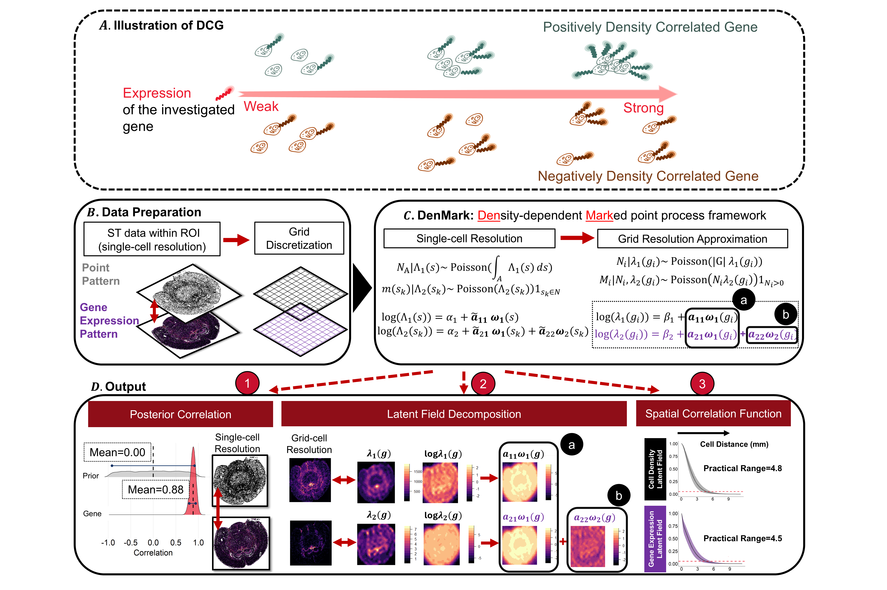

# DenMark
**DenMark** (<ins>**Den**</ins>sity-dependent <ins>**Mark**</ins>ed Point process framework) is a model-based statistical framework to quantify how gene expression varies with local cell density and to identify density-correlated genes (DCGs). It is designed for single-cell resolution spatial transcriptomics data such as MERFISH, Xenium and SeqFISH, where cell location and gene expression at the single-cell resolution is provided.

------
## DenMark Workflow 

Implemented with a density-dependent marked point process, as well as comparing to the one with independent marked point process, DenMark enables downstream analyses such as:

- jointly quantify the spatial heterogeneity of the cell locations and a typical gene expression (candidate gene);
- quantify the correlation between cell density and gene expression
- identify the DCGs in the provided single-cell resolution spatial transcriptomics dataset 

This repository contains the reference R implementation used in the DenMark manuscript.

------
## Repository layout

- `DenMark/`  
  Core Python implementation of GALAXY (alignment and peak-group functions).

- `CodeInPaper/`  
  Scripts used to generate the figures and results in the manuscript
  (simulation study, macrophage regression data, canine sarcoma data, etc.).

- `Tutorial_GALAXY.ipynb`  
  A Jupyter notebook tutorial that walks through aligning two MALDI datasets
  (e.g., Week 2 and Week 5 regression samples) and preparing them for joint
  segmentation.

- `LICENSE`  
  License for using and modifying this code.

-----
## A Quick Start 

------
## Reproducing results from the manuscript

The scripts in CodeInPaper/ (to be documented) correspond to the main analyses:

- Simulation study (mouse pancreas MALDI)
Evaluates alignment error under controlled peak shifts and noise.

- Atherosclerosis regression (macrophage metabolomics)
Aligns Week 5 MALDI spectra to Week 2, evaluates performance using anchor m/z
points, and performs joint spatial segmentation.

- Canine sarcoma data
Aligns cancer tissue spectra to normal tissue, assesses classification
performance before and after alignment, and performs joint clustering across
cancer samples.

Data sources:

- Mouse pancreas MALDI: https://doi.org/10.5281/zenodo.3607915

- Atherosclerosis regression MALDI: available from the data owners upon reasonable request.

- Canine carcinoma MALDI: PRIDE accession PXD010990
(https://proteomecentral.proteomexchange.org/cgi/GetDataset?ID=PXD010990)

